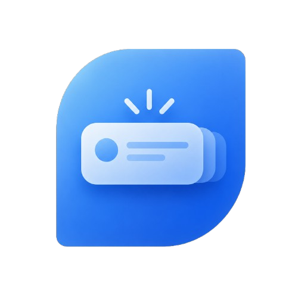

<p align="center">
  
</p>

# SailPush

Unofficial Pushover client for SailfishOS. Real-time notifications via WebSocket, background daemon with systemd integration.

## Background Delivery & Battery

- **Screen on:** persistent WebSocket for instant delivery.
- **Screen off:** polls Pushover on the configured interval (1–30 min, default 5). Messages are queued server-side, so nothing is lost.

Want real-time delivery while the screen is off? Enable **Keep Connection Alive When Screen Off** in Settings — it uses a per-app keepalive (higher battery use, but scoped to SailPush rather than the whole device).

> Note: while the screen is off, polling only fires while the device is awake; wake-from-deep-sleep polling is not yet supported. After a daemon restart, open the app to catch any messages that didn't notify.

## Install

Download the `.rpm` for your architecture from [Releases](https://github.com/zackslash/SailPush/releases):

```bash
devel-su pkcon install-local ./sailpush-<version>.rpm
systemctl --user daemon-reload
systemctl --user enable --now sailpush.service
```

Upgrading: install the new RPM over the old one. Credentials and settings are preserved.

## Build

Requires Sailfish OS SDK.

```bash
qmake5 && make        # local build
mb2 build             # RPM build
```

The unit tests under `tests/` build and run on a regular Linux box with Qt5
(no Sailfish SDK needed for the pure-Qt suites):

```bash
cmake -S tests -B tests/build && cmake --build tests/build && ctest --test-dir tests/build
```

## Architecture

Two-process model: **UI** (QML) communicates with **daemon** (background, systemd) over D-Bus (`com.zackslash.sailpush`). The daemon maintains a persistent WebSocket to Pushover servers and handles notifications.

## License

MIT. Unofficial client, not endorsed by Pushover, LLC.
